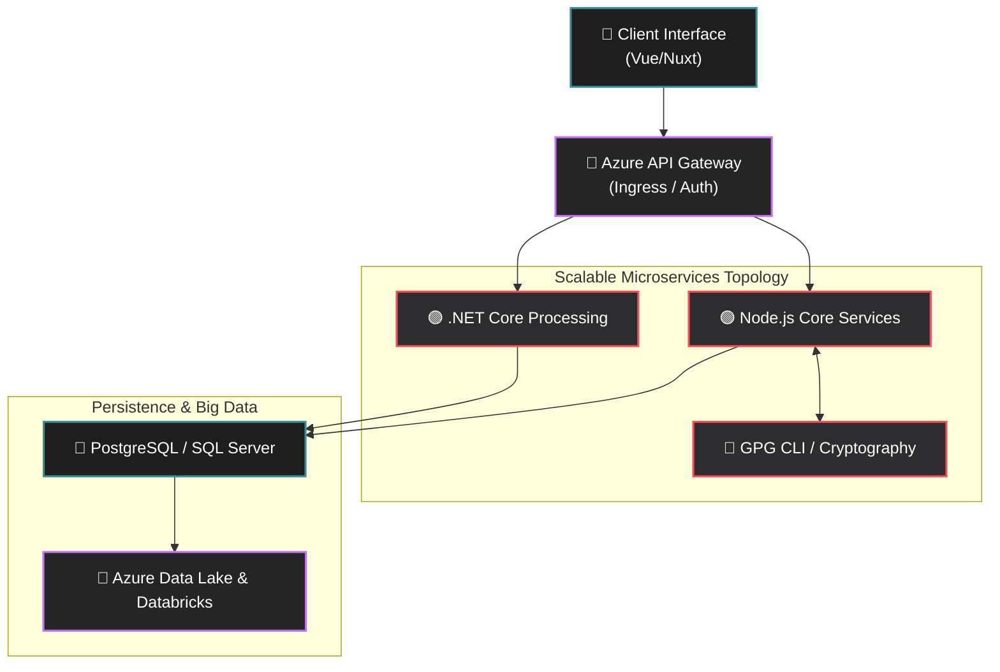

<!-- BANNER (Auto Dark/Light Theme Support) -->
<picture>
  <source media="(prefers-color-scheme: dark)" srcset="https://capsule-render.vercel.app/api?type=waving&color=0:3b8d99,100:aa4b6b&height=250&section=header&text=Vimlesh%20Kumar&fontSize=70&fontColor=ffffff&animation=fadeIn&desc=Core%20Engineer%20%7C%20Language%20Designer&descAlign=50&descAlignY=65" />
  <source media="(prefers-color-scheme: light)" srcset="https://capsule-render.vercel.app/api?type=waving&color=0:12c2e9,50:c471ed,100:f64f59&height=250&section=header&text=Vimlesh%20Kumar&fontSize=70&fontColor=ffffff&animation=fadeIn&desc=Core%20Engineer%20%7C%20Language%20Designer&descAlign=50&descAlignY=65" />
  
</picture>

<p align="center">
  <a href="https://github.com/Vimlesh-Kumar">
    <picture>
      <source media="(prefers-color-scheme: dark)" srcset="https://readme-typing-svg.demolab.com?font=Fira+Code&weight=500&size=20&pause=1000&color=F8F8F8&center=true&vCenter=true&width=600&lines=Core+Engineer;Language+Designer;Microservices+Architect;Backend+Optimization+Expert" />
      <source media="(prefers-color-scheme: light)" srcset="https://readme-typing-svg.demolab.com?font=Fira+Code&weight=500&size=20&pause=1000&color=2C5364&center=true&vCenter=true&width=600&lines=Core+Engineer;Language+Designer;Microservices+Architect;Backend+Optimization+Expert" />
      
    </picture>
  </a>
</p>

<p align="center">
  <a href="https://linkedin.com/in/vimlesh11"></a>
  <a href="mailto:vimlesh11072000@gmail.com"></a>
  
</p>

---

## 🧠 Architecting the Future

I'm a seasoned **Full-stack Developer & Core Engineer** focusing primarily on designing sophisticated systems. I build everything from high-performance microservices to the semantic foundations of my own programming language. My approach favors deep optimization, mathematical rigor in backend validations, and scalable enterprise architecture.

- ⚙️ **Language Design:** Currently constructing a human-readable programming language from the ground up.
- 🏗️ **Distributed Systems:** Architecting scalable microservices on Azure, integrating Data Lakes and Databricks.
- ⚡ **Performance Obsessed:** Driving massive reductions in time/space complexity (e.g. migrating Node.js to .NET, optimizing ORMs, Vue 3 reactivity).
- 🧩 **Clean Code:** Standardizing automated QA processes and building resilient CI/CD pipelines.

---

## 🏗 System Architecture Playground



---

## ⚙️ Engineering Arsenal

**Foundational Skills**

<p align="left">
  <picture>
    
  </picture>
</p>

**Backend & Architecture**

<p align="left">
  <picture>
    
  </picture>
</p>

**Cloud, DevOps & Tooling**

<p align="left">
  <picture>
    
  </picture>
</p>

**Frontend Horizons**

<p align="left">
  <picture>
    
  </picture>
</p>

---

## 📈 GitHub Matrix & Coding Telemetry

<p align="center">
  <!-- GitHub Stats (Dark/Light support) -->
  <picture>
    <source media="(prefers-color-scheme: dark)" srcset="https://github-readme-stats-anuraghazra1.vercel.app/api?username=Vimlesh-Kumar&show_icons=true&theme=tokyonight&hide_border=true&bg_color=0D1117" />
    <source media="(prefers-color-scheme: light)" srcset="https://github-readme-stats-anuraghazra1.vercel.app/api?username=Vimlesh-Kumar&show_icons=true&theme=default&hide_border=true" />
    
  </picture>
  
  <!-- Top Langs (Dark/Light support) -->
  <picture>
    <source media="(prefers-color-scheme: dark)" srcset="https://github-readme-stats-anuraghazra1.vercel.app/api/top-langs/?username=Vimlesh-Kumar&layout=compact&theme=tokyonight&hide_border=true&bg_color=0D1117" />
    <source media="(prefers-color-scheme: light)" srcset="https://github-readme-stats-anuraghazra1.vercel.app/api/top-langs/?username=Vimlesh-Kumar&layout=compact&theme=default&hide_border=true" />
    
  </picture>
</p>

### 🏆 Trophies & Streaks

<p align="center">
  <!-- Streak Stats (Dark/Light support) -->
  <picture>
    <source media="(prefers-color-scheme: dark)" srcset="https://streak-stats.demolab.com?user=Vimlesh-Kumar&theme=tokyonight&hide_border=true&background=0D1117" />
    <source media="(prefers-color-scheme: light)" srcset="https://streak-stats.demolab.com?user=Vimlesh-Kumar&theme=default&hide_border=true" />
    
  </picture>
</p>

<p align="center">
  <!-- Trophies -->
  <picture>
    <source media="(prefers-color-scheme: dark)" srcset="https://github-profile-trophy-ryo-ma.vercel.app/?username=Vimlesh-Kumar&theme=radical&no-frame=true&no-bg=true&margin-w=15&row=1" />
    <source media="(prefers-color-scheme: light)" srcset="https://github-profile-trophy-ryo-ma.vercel.app/?username=Vimlesh-Kumar&theme=flat&no-frame=true&no-bg=true&margin-w=15&row=1" />
    
  </picture>
</p>

### ⏱ WakaTime Development Activity

_(Auto-updated daily via GitHub Actions)_

<!--START_SECTION:waka-->


**🐱 My GitHub Data** 

> 📦 45.3 kB Used in GitHub's Storage 
 > 
> 🏆 241 Contributions in the Year 2026
 > 
> 💼 Opted to Hire
 > 
> 📜 51 Public Repositories 
 > 
> 🔑 9 Private Repositories 
 > 
📅 **I'm Most Productive on Saturday** 

```text
Monday                   56 commits          ██░░░░░░░░░░░░░░░░░░░░░░░   07.57 % 
Tuesday                  104 commits         ████░░░░░░░░░░░░░░░░░░░░░   14.05 % 
Wednesday                67 commits          ██░░░░░░░░░░░░░░░░░░░░░░░   09.05 % 
Thursday                 67 commits          ██░░░░░░░░░░░░░░░░░░░░░░░   09.05 % 
Friday                   69 commits          ██░░░░░░░░░░░░░░░░░░░░░░░   09.32 % 
Saturday                 260 commits         █████████░░░░░░░░░░░░░░░░   35.14 % 
Sunday                   117 commits         ████░░░░░░░░░░░░░░░░░░░░░   15.81 % 
```


📊 **This Week I Spent My Time On** 

```text
💬 Programming Languages: 
Vue                      2 hrs 39 mins       ██████████░░░░░░░░░░░░░░░   41.95 % 
JavaScript               1 hr 37 mins        ██████░░░░░░░░░░░░░░░░░░░   25.66 % 
Markdown                 1 hr 7 mins         ████░░░░░░░░░░░░░░░░░░░░░   17.87 % 
JSON                     20 mins             █░░░░░░░░░░░░░░░░░░░░░░░░   05.52 % 
TypeScript               20 mins             █░░░░░░░░░░░░░░░░░░░░░░░░   05.28 % 

🔥 Editors: 
Antigravity IDE          3 hrs 37 mins       ██████████████░░░░░░░░░░░   57.23 % 
Claude Code              2 hrs 26 mins       ██████████░░░░░░░░░░░░░░░   38.65 % 
VS Code                  15 mins             █░░░░░░░░░░░░░░░░░░░░░░░░   04.12 % 
```

**I Mostly Code in JavaScript** 

```text
JavaScript               10 repos            ████████░░░░░░░░░░░░░░░░░   30.30 % 
Vue                      9 repos             ███████░░░░░░░░░░░░░░░░░░   27.27 % 
TypeScript               7 repos             █████░░░░░░░░░░░░░░░░░░░░   21.21 % 
HTML                     4 repos             ███░░░░░░░░░░░░░░░░░░░░░░   12.12 % 
C++                      1 repo              █░░░░░░░░░░░░░░░░░░░░░░░░   03.03 % 
```


**Timeline**


 Last Updated on 25/07/2026 19:40:26 UTC
<!--END_SECTION:waka-->

---

## 🐍 Contribution Snake

_(Animation updates dynamically via GitHub Actions)_

<p align="center">
  <picture>
    <source media="(prefers-color-scheme: dark)" srcset="https://raw.githubusercontent.com/Vimlesh-Kumar/Vimlesh-Kumar/output/github-contribution-grid-snake-dark.svg" />
    <source media="(prefers-color-scheme: light)" srcset="https://raw.githubusercontent.com/Vimlesh-Kumar/Vimlesh-Kumar/output/github-contribution-grid-snake.svg" />
    
  </picture>
</p>

---
